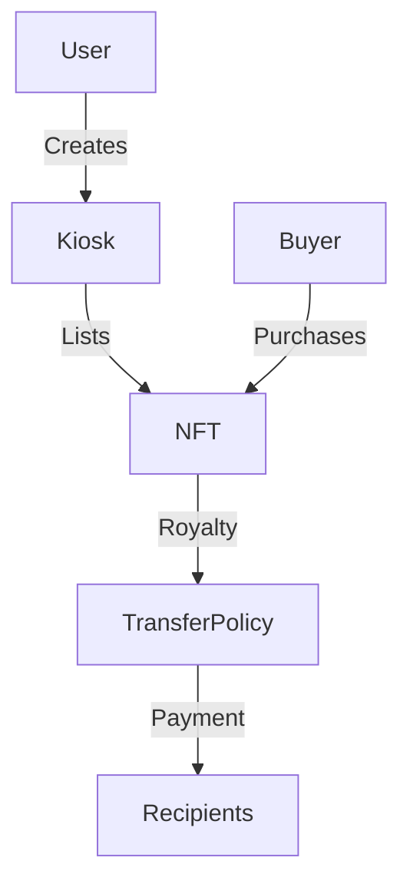

# Kiosk Integration - Architecture Decision Record

## Context

Our NFT collection needs to be compatible with Sui's Kiosk system to enable marketplace functionality. While we have implemented a `TransferPolicy` for our NFTs, we need to ensure proper kiosk compatibility and understand how users will interact with our NFTs through kiosks.

## Decision

We will maintain kiosk compatibility for our NFTs while keeping the marketplace functionality separate from our core contract. This means:

1. Our NFT type (`OffbrandNFT`) will remain kiosk-compatible by:
   - Maintaining `key` and `store` abilities
   - Keeping the shared `TransferPolicy<OffbrandNFT>` object
   - Not implementing kiosk-specific functions in our contract

2. Marketplace operations will be handled by:
   - Sui's Kiosk system for listing, buying, and withdrawing NFTs
   - Frontend integration with the Kiosk module
   - Users interacting directly with kiosks for marketplace operations

## Status

Approved

## Consequences

### Positive

- NFTs can be listed and traded on any Sui marketplace that uses the Kiosk system
- No additional contract complexity for marketplace operations
- Standard marketplace integration through Sui's Kiosk framework
- Royalty enforcement through our existing `TransferPolicy`

### Negative

- No custom marketplace logic in our contract
- Users need to use external kiosk interfaces for trading
- No built-in marketplace features specific to our collection

## Technical Details

### 1. Current Kiosk Compatibility Status

| Requirement                      | Status | Implementation Details |
|----------------------------------|:------:|----------------------|
| `key`, `store` abilities         | ✅     | `OffbrandNFT` struct |
| TransferPolicy published         | ✅     | `init_collection`    |
| Kiosk module imports             | ❌     | Not needed           |
| Kiosk listing/buying functions   | ❌     | Handled by Sui Kiosk |

### 2. Implementation Details

```move
// Our NFT type is already kiosk-compatible
public struct OffbrandNFT has key, store {
    id: object::UID,
    name: String,
    description: String,
    creator: address,
    mint_number: u64,
    royalty_info: vector<RoyaltyRecipient>,
}

// We create and share the TransferPolicy in init_collection
public entry fun init_collection(
    // ... other parameters ...
) {
    let (policy, policy_cap) = transfer_policy::new<OffbrandNFT>(&publisher, ctx);
    let policy_id = object::id(&policy);
    
    // Share the TransferPolicy for kiosk compatibility
    transfer::public_share_object(policy);
    
    // ... rest of the function ...
}
```

### 3. Kiosk Integration Flow



## Usage Examples

### 1. Creating a Kiosk (Frontend)

```typescript
import { KioskClient, Network } from '@mysten/kiosk';

const kioskClient = new KioskClient({
    network: Network.TESTNET
});

// Create a kiosk
const txb = new TransactionBlock();
const kiosk = await kioskClient.createKiosk(txb);
```

### 2. Listing an NFT (Frontend)

```typescript
// List NFT in kiosk
const txb = new TransactionBlock();
await kioskClient.list({
    kiosk: kioskId,
    item: nftId,
    price: priceInMist,
    txb
});
```

### 3. Purchasing an NFT (Frontend)

```typescript
// Purchase NFT from kiosk
const txb = new TransactionBlock();
await kioskClient.purchase({
    kiosk: kioskId,
    item: nftId,
    price: priceInMist,
    txb
});
```

## Future Considerations

1. **Custom Marketplace Features**
   - Could add custom marketplace logic in future versions
   - Would require importing `sui::kiosk` module
   - Could implement collection-specific marketplace features

2. **Enhanced Royalty Integration**
   - Current royalty system works with kiosks through `TransferPolicy`
   - Could add custom royalty distribution logic
   - Could implement multiple recipient support

3. **Kiosk Management**
   - Could add admin functions for kiosk management
   - Could implement collection-wide kiosk policies
   - Could add kiosk-specific metadata

4. **Marketplace Integration**
   - Could develop a custom marketplace UI
   - Could implement collection-specific marketplace features
   - Could add analytics and tracking

## Testing Kiosk Compatibility

1. **Basic Compatibility Test**
   ```bash
   # Create a kiosk
   sui client call --package 0x2 --module kiosk --function create --gas-budget 10000000

   # List an NFT
   sui client call --package 0x2 --module kiosk --function list \
     --args <KIOSK_ID> <NFT_ID> <PRICE> --gas-budget 10000000
   ```

2. **Royalty Enforcement Test**
   ```bash
   # Purchase NFT and verify royalty payment
   sui client call --package 0x2 --module kiosk --function purchase \
     --args <KIOSK_ID> <NFT_ID> <PRICE> --gas-budget 10000000
   ```

## References

- [Sui Kiosk Framework](https://github.com/MystenLabs/sui/blob/main/crates/sui-framework/docs/sui/kiosk.md)
- [TransferPolicy and Kiosk Integration](https://github.com/sui-foundation/sui-move-intro-course/blob/main/unit-five/lessons/5_transfer_policy.md)
- [Sui Kiosk SDK](https://www.npmjs.com/package/@mysten/kiosk) 